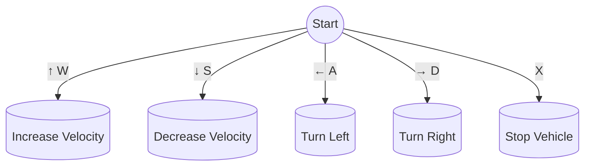

# air_twizy_simulation

This repository contains the Central codebase for the AIR team's sd_twizy vehicle, encompassing both simulation models and real-world implementation using ROS2.

<div align="center">


</div>

## Usage

### Prerequisites

#### Install Docker

Ensure that Docker is installed on your system. You can download it from the official Docker website. Docker compose is also required, and you can install it by following the instructions on the official Docker Compose website.

### Installation

#### Step 1: Clone the repository
Clone the air_systemTwizy repository to your local machine using the following command:

```bash
git clone git@github.com:AIR-UFG/air_twizy_simulation.git --recursive
```

#### Step 2: Build the Docker image
Navigate to the cloned directory and build the Docker image with the provided Dockerfile:

```bash
cd air_twizy_simulation
docker build -t air-twizy-simulation -f docker/Dockerfile .
```
### Running the Simulation

#### Step 1: Start the Simulation

To start the simulation using docker, run the following command setting the desired parameters:

```bash
./run.sh RVIZ=true GPU=false PROJECTION=false
```

The `run.sh` script allows you to set certain environment variables that control the behavior of the Docker container. You can set these variables by passing arguments to the script in the format KEY=value. The supported variables are:

- `GPU`: Allows the user to run the PointCloud Process Plugin with GPU usage. Default value is set to `false`
- `RVIZ`: Open Ros Visualization Tool. Default value is set to `false`.
- `PROJECTION`: Enables the projection pf the point cloud in 2D. Default value is set to `false`.
- `WORLD_NAME`: The name of the world file to be used in the simulation. Default value is set to `ufg_default.world`.
- `FOV_UP`: Field of view up. Default: 15.0 degrees.
- `FOV_DOWN`: Field of view down. Default: -15.0 degrees.
- `WIDTH`: Width of the projection. Default: 440 pixels, due to gazebo limitations.
- `HEIGHT`: Height of the projection. Default: 16 pixels, due the VLP-16 configuration.
- `WITH_VI`: Launch the vehicle interface. Default value is set to `false`.

#### Step 2: Control the vehicle

Once the simulation has started, press play in the Gazebo window. 

Open another terminal **outside the container** and **inside the air_systemTwizy directory**. Then execute:

```bash
./bash_container.sh
```

Then You can control the vehicle using the keyboard running:

```bash
ros2 run vehicle_control sd_teleop_keyboard_control.py
```

Follow the instructions bellow to control the vehicle:

<div align="center">


</div>

### Recording and Playing a Bag File

Once all the processes above are already up and running, open another terminal outside the container and navigate to the `air_systemTwizy` directory. Execute the following commands:

```bash
./bash_container.sh
```
Go to the `host` directory that is mounted inside the container:

```bash
cd ~/host
```

Execute the ros2 command to record the bag:

```bash
ros2 bag record -o <bag_name> /velodyne_points
```

Control the vehicle through the city as you wish and then terminate the process with Ctrl+C. The bag will be stored in the `host` directory, which can be accessed both from within and outside the container.

NOTE: The command above will only record the `/velodyne_points` topic. If you want to record all topics, replace /velodyne_points with -a in the ros2 bag record command:

```
ros2 bag record -o <bag_name> -a
```