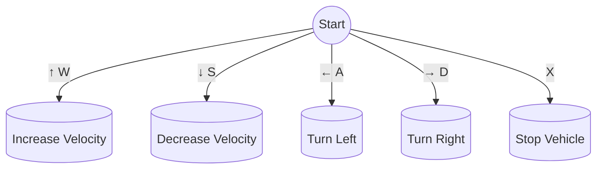

# air_twizy_simulation

This repository contains the central codebase for the AIR team's sd_twizy vehicle, encompassing both simulation models and real-world implementation using ROS2.

<div align="center">


</div>

## Repository Tree

```
air_twizy_simulation/
│
├── docker/
│   ├── docker-compose.yml
│   └── Dockerfile
│
├── ros_packages/
│   ├── vehicle_interface_packages/
│   │   ├── ros2_socketcan/
│   │   ├── SD-VehicleInterface/
│   │   ├── .gitmodules
│   │   └── README.md
│   │
│   └── vehicle_simulation_packages/
│       ├── air_description/
│       ├── air_docs/
│       ├── air_sim/
│       └── vehicle_control_plugin/
│
├── utils/
│   ├── bash_container.sh
│   ├── build_docker.sh
│   ├── record_bag.sh
│   ├── run.sh
│   └── verify_submodules.sh
│
├── .env
├── .gitmodules
└── README.md
```

## Usage

### Prerequisites

#### Install Docker

Ensure that Docker is installed on your system. You can download it from the official Docker website. Docker Compose is also required, and you can install it by following the instructions on the official Docker Compose website.

### Installation

#### Step 1: Clone the Repository

Clone the air_twizy_simulation repository to your local machine using the following command:

```bash
git clone https://github.com/AIR-UFG/air_twizy_simulation.git
```

#### Step 2: Build the Docker Image

Navigate to the cloned directory and build the Docker image using the provided build script:

```bash
cd air_twizy_simulation
./utils/build_docker.sh
```

### Running the Simulation

#### Step 1: Start the Simulation

To start the simulation using Docker, run the following command setting the desired parameters:

```bash
./utils/run.sh ROBOT_POSE="6.0,-1.0,0.3,0.0,0.0,0.0" GPU=false RVIZ=false
```

The `run.sh` script allows you to set certain environment variables that control the behavior of the Docker container. You can set these variables by passing arguments to the script in the format `KEY=value`. The supported variables are:

- `GPU`: Allows the user to run the PointCloud Process Plugin with GPU usage. Default value is set to `false`
- `RVIZ`: Open ROS Visualization Tool. Default value is set to `false`.
- `WORLD_NAME`: The name of the world file to be used in the simulation. Default value is set to `ufg_default.world`.
- `FOV_UP`: Field of view up. Default: 15.0 degrees.
- `FOV_DOWN`: Field of view down. Default: -15.0 degrees.
- `WIDTH`: Width of the projection. Default: 440 pixels, due to Gazebo limitations.
- `HEIGHT`: Height of the projection. Default: 16 pixels, due to the VLP-16 configuration.
- `WITH_VI`: Launch the vehicle interface. Default value is set to `false`.
- `ROBOT_POSE`: Set the initial pose of the robot. It is a 6D pose in the format `x, y, z, roll, pitch, yaw`. Default value is set to `6.0, -1.0, 0.3, 0.0, 0.0, 0.0`. It must be passed as a string and the city`s map is shown [here](https://github.com/AIR-UFG/vehicle_simulation_packages/raw/development/air_docs/imgs/xy_city.png).


<div align="center">


</div>

#### Step 2: Control the Vehicle

Once the simulation has started, press play in the Gazebo window.

Open another terminal **outside the container** and **inside the air_twizy_simulation directory**. Then execute:

```bash
./utils/bash_container.sh
```

Then you can control the vehicle using the keyboard by running:

```bash
ros2 run vehicle_control sd_teleop_keyboard_control.py
```

Follow the instructions below to control the vehicle:

<div align="center">


</div>

### Recording and Playing a Bag File

Once all the processes above are already up and running, open another terminal outside the container and navigate to the `air_twizy_simulation` directory. Execute the following command to enter the container:

```bash
./utils/bash_container.sh
```

Execute the command to record the bag with specific topics:

```bash
./utils/record_bag.sh <bag_prefix> <mode> [<topic>...]
```

Where `<bag_prefix>` is the prefix name of the bag file, `<mode>` is the mode of recording (`specific` or `all`), and `<topic>` is the topic to be recorded. Note that when on specific mode, you can pass multiple topics to be recorded, such as `/topic_1 /topic_2 ...`.

If you want to record only the `/velodyne_points` topic, for example, you can use the following command:

```bash
./utils/record_bag.sh ros2_bag specific /velodyne_points
```

If you want to record all topics, use:

```bash
./utils/record_bag.sh <bag_prefix> all
```

Once the bag is being recorded you may control the vehicle through the city as you wish and then terminate the process with `Ctrl+C`.

The bag will be recorded inside the `shared_folder` directory that will be created in the `air_twizy_simulation` directory of the host machine when the container is started. This directory is shared between the host and the container. 